# Design of claim-verify-rag

How the pipeline is built, and **why** each choice was made. Diagrams first, short text.

**Contents**
1. [Overview](#1-overview)
2. [Data contracts](#2-data-contracts)
3. [Verdicts](#3-verdicts)
4. [Stage interfaces](#4-stage-interfaces)
5. [Configuration](#5-configuration)
6. [Orchestrators](#6-orchestrators)
7. [Events and run folders](#7-events-and-run-folders)
8. [LLM calls: retries](#8-llm-calls-retries)
9. [LLM calls: usage meter](#9-llm-calls-usage-meter)
10. [Code organization](#10-code-organization)
11. [Tests](#11-tests)
12. [All design decisions](#12-all-design-decisions)
13. [Details worth remembering](#13-details-worth-remembering)
14. [Known limits and next steps](#14-known-limits-and-next-steps)

---

## 1. Overview

Two pipelines share one embedding model and one vector store.

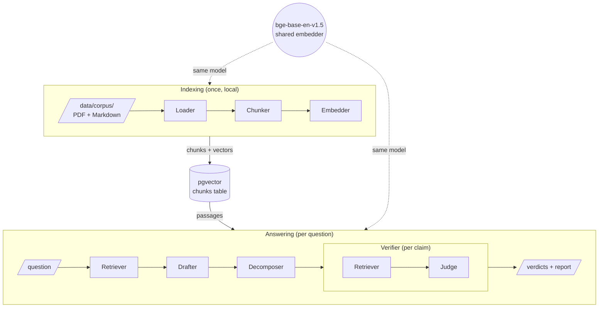

| Stage | Implementation today | Model | Runs on |
|---|---|---|---|
| Loader | PDF + Markdown files | none | local |
| Chunker | fixed windows of 512 words, 15% overlap | none | local |
| Embedder | `BAAI/bge-base-en-v1.5`, 768 dimensions | embedding model | your GPU (CPU works) |
| Retriever | pgvector, top-k **per document** | the shared embedder | GPU + Postgres |
| Drafter | LLM with a grounded, cited prompt | `openai/gpt-oss-120b` | Groq API |
| Decomposer | LLM in JSON mode | `openai/gpt-oss-120b` | Groq API |
| Judge | LLM in JSON mode | `qwen/qwen3.8-27b` | Groq API |

> **Why a different model for the judge?** A model checking its own answer repeats its own
> mistakes and tends to approve itself. The judge (Qwen, Alibaba) is from a different family
> than the drafter (gpt-oss, OpenAI). A test fails if `config.yaml` ever breaks this rule.

---

## 2. Data contracts

Every object passed between stages is a Pydantic model, defined once in `contracts.py`.

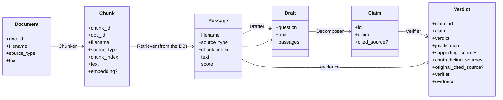

| Property | Why |
|---|---|
| **Named fields, not tuples** | a new retriever returning fields in another order can't silently scramble the data |
| **Validated at runtime** (Pydantic) | LLM output is untrusted; a malformed claim fails *at the decomposer*, not three stages later |
| **Serializable to JSON** | each stage can run alone from the previous stage's file (`draft.json` → `claims.json` → `verdicts.json`) |
| **`Chunk.embedding` optional** | the same object goes through the chunker (no vector yet) and the embedder (vector added) |
| **`Verdict.evidence`** | the exact passages the judge read: needed to debug a verdict and to show it in the UI |

**Stored form:** one PostgreSQL table, written by indexing and read by the retrievers.

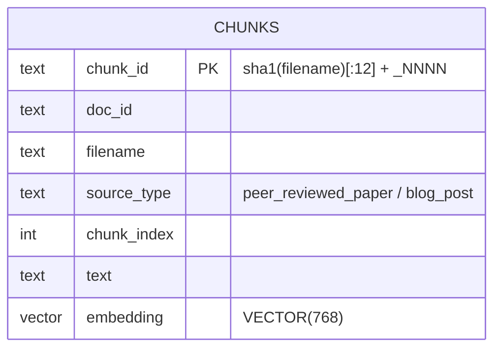

---

## 3. Verdicts

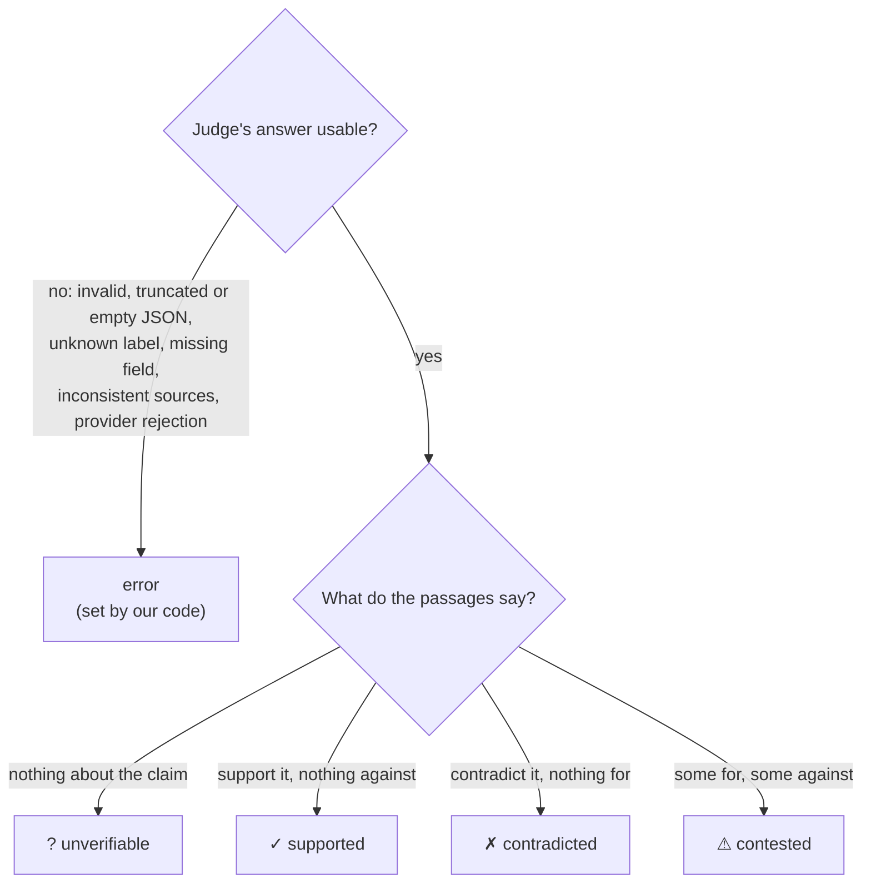

| Label | Chosen by | Rule enforced by the `Verdict` contract |
|---|---|---|
| `supported` | judge | none |
| `contradicted` | judge | at least one contradicting source |
| `contested` | judge | at least one source **on each side** |
| `unverifiable` | judge | none |
| `error` | **our code only**, never offered to the judge | none; keeps the raw answer in the justification |

> **Why `contested`?** The corpus contains a real disagreement (Vectara vs LumberChunker).
> Folding it into `contradicted` would hide the most important thing the system can report.
>
> **Why `error` instead of `unverifiable`?** `unverifiable` is a conclusion about the sources.
> `error` means "we don't know what the judge concluded". Mixing them would distort the
> evaluation and hide failures, and only an `error` can be fixed by retrying.
>
> **Why the source rules?** In the first real run, a verdict said `contradicted` with an empty
> list of contradicting sources. A verdict must be consistent with what it cites.

---

## 4. Stage interfaces

Each stage is a `Protocol` (what it does) with one implementation today (how).

```mermaid
classDiagram
    direction LR
    class Loader {
        <<Protocol>>
        +load(corpus_dir) list~Document~
    }
    class Chunker {
        <<Protocol>>
        +chunk(documents) list~Chunk~
    }
    class Embedder {
        <<Protocol>>
        +embed_texts(texts)
        +embed_query(text)
    }
    class Retriever {
        <<Protocol>>
        +retrieve(query) list~Passage~
    }
    class Drafter {
        <<Protocol>>
        +draft(question, passages) Draft
    }
    class Decomposer {
        <<Protocol>>
        +decompose(draft) list~Claim~
    }
    class Judge {
        <<Protocol>>
        +judge(claim, passages) Verdict
    }
    class Verifier {
        <<Protocol>>
        +verify(claims) Iterator~Verdict~
    }

    Loader <|.. FileLoader
    Chunker <|.. FixedSizeChunker
    Embedder <|.. BgeEmbedder
    Retriever <|.. PgvectorRetriever
    Drafter <|.. LLMDrafter
    Decomposer <|.. LLMDecomposer
    Judge <|.. LLMJudge
    Verifier <|.. LangGraphVerifier

    PgvectorRetriever o-- Embedder : receives
    LangGraphVerifier o-- Retriever : receives
    LangGraphVerifier o-- Judge : receives
```

**Injection:** stages *receive* what they need, they never create it.

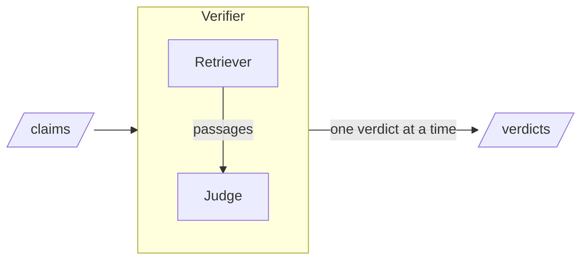

| Choice | Why |
|---|---|
| **`Protocol`**, not an abstract base class | an implementation only needs the right methods: a third-party class (e.g. an NLI classifier) fits without inheriting from our code |
| **Judge and Verifier are separate** | swap only the judge (Qwen → NLI), only the retriever (pgvector → hybrid), or the whole verifier |
| **The verifier yields verdicts one at a time** | progress can be shown and saved while verification runs |
| **LangGraph state holds only data** | the model, connection and LLM are injected into the nodes, not carried in the state |
| **Lazy embedder** | building the stages costs nothing; the model loads on first use |

> **About LangGraph:** today the verifier is a straight loop (retrieve → judge per claim), so
> LangGraph adds structure but makes no decision. The roadmap plans an experiment comparing it
> with a plain loop and with an agentic loop that re-retrieves when the verdict is `unverifiable`.

---

## 5. Configuration

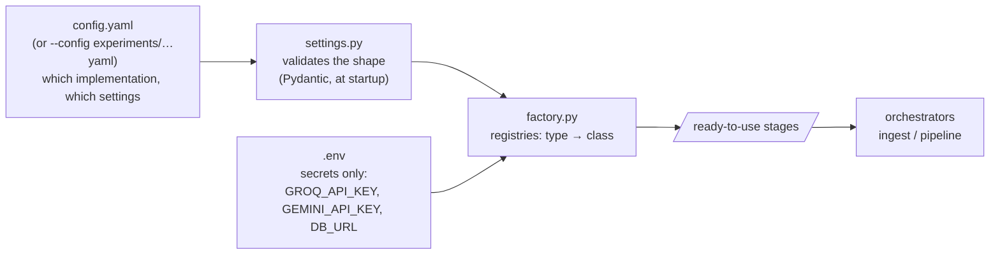

**`config.yaml` structure**

```
providers:   groq, gemini        base_url · api_key_env · max_retries · max_wait_seconds · timeout_seconds
embedding:   type: bge           model · device                        ← shared by both pipelines
indexing:    loader              type: files
             chunker             type: fixed_size · chunk_size · overlap_ratio
answering:   retriever           type: pgvector · top_k_per_doc        ← used by the drafter
             drafter             type: llm · provider · model
             decomposer          type: llm · provider · model
             verifier            type: langgraph
               retriever         type: pgvector · top_k_per_doc        ← its own retriever
               judge             type: llm · provider · model
```

**Registries in `factory.py`**

| Stage | `type` → class |
|---|---|
| loader | `files` → `FileLoader` |
| chunker | `fixed_size` → `FixedSizeChunker` |
| embedding | `bge` → `BgeEmbedder` |
| retriever | `pgvector` → `PgvectorRetriever` |
| drafter / decomposer / judge | `llm` → `LLMDrafter` / `LLMDecomposer` / `LLMJudge` |
| verifier | `langgraph` → `LangGraphVerifier` |

**Adding an implementation** (e.g. an NLI judge): write the class → add its settings model in
`settings.py` → add one line to the registry. No orchestrator changes (open/closed principle).

| Choice | Why |
|---|---|
| **Secrets in `.env`, choices in `config.yaml`** | the config can be committed and shared; keys never are |
| **The config names the key variable** (`api_key_env`) | each provider only ever receives its own key |
| **Strict validation** (`extra="forbid"`) | a typo (`chunk_sise`) or an undeclared provider stops the run at startup with its exact location |
| **One file per experiment** (`--config`) | every result can be traced to a committed file; e.g. `experiments/smoke_k1.yaml` |
| **Old per-role `.env` variables trigger a warning** | they are ignored now, and must not mislead silently |

---

## 6. Orchestrators

The orchestrators only chain interfaces. They don't know which model, database or library a stage uses.

**Indexing** (`indexing/ingest.py`)

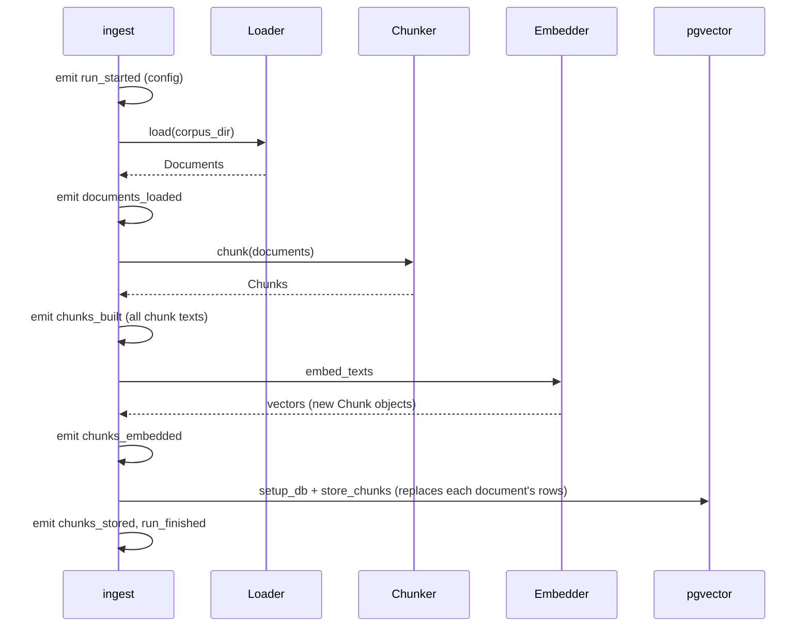

**Answering** (`answering/pipeline.py`), for each question

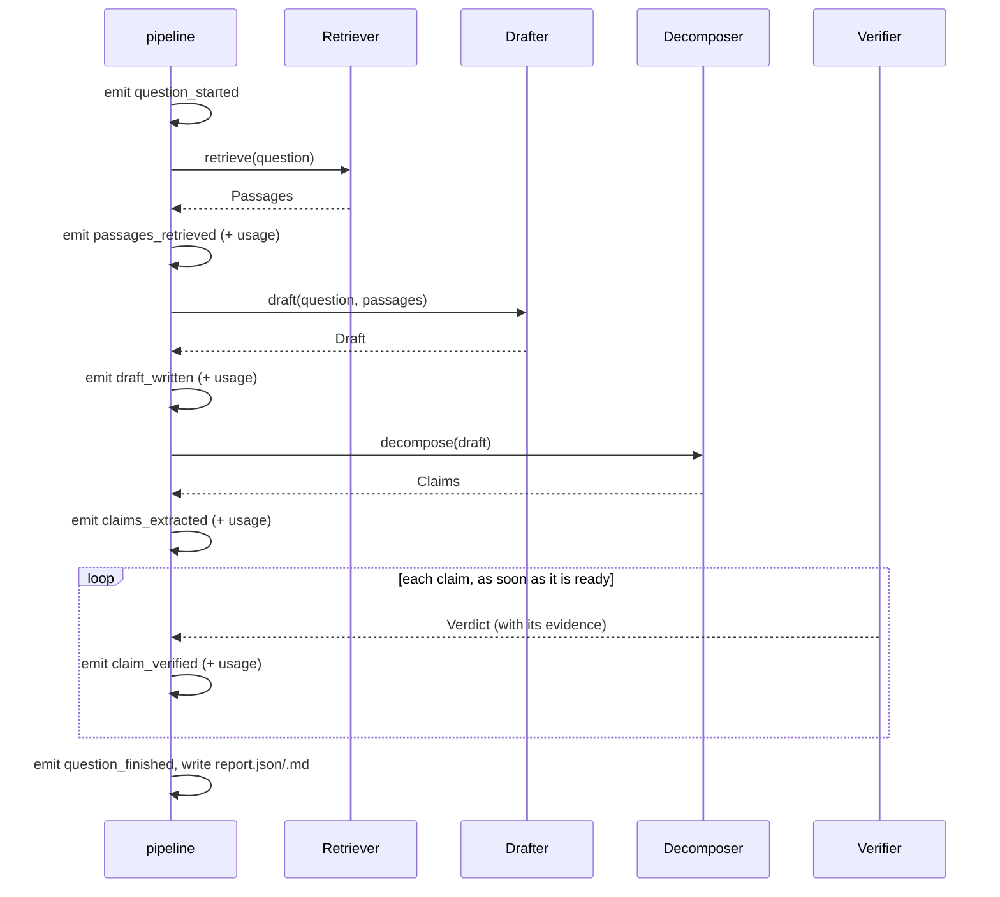

> **Why is the orchestrator the only one to emit?** Stages stay pure: input → output, no
> display code. Any stage can be replaced without touching how progress is shown.

---

## 7. Events and run folders

**Observer pattern:** the pipeline emits events; sinks decide what to do with them.

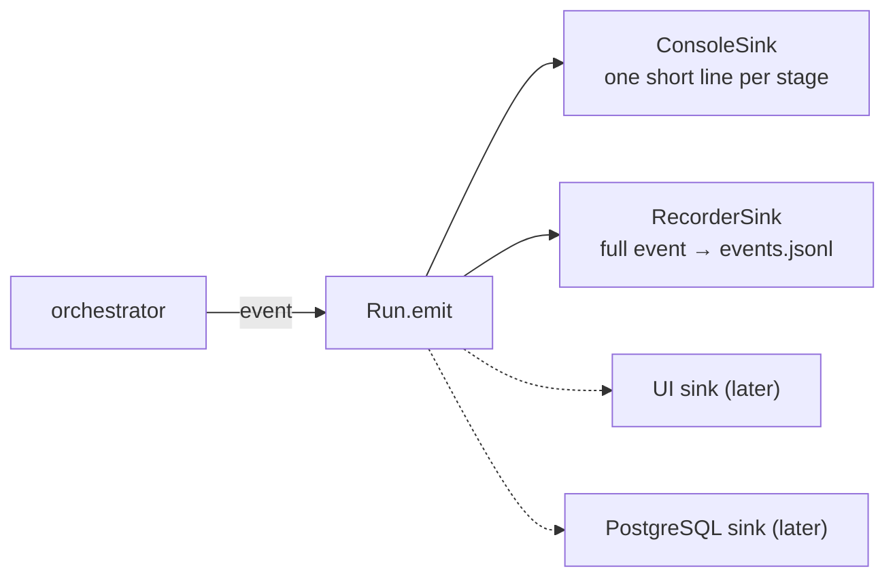

**One folder per run**

```
runs/
├── 20260926_142114_indexing/
│   └── events.jsonl          run_started · documents_loaded · chunks_built · chunks_embedded · chunks_stored · run_finished
└── 20260926_150302_answering/
    ├── events.jsonl          run_started · question_started · passages_retrieved · draft_written ·
    │                         claims_extracted · claim_verified × N · question_finished · run_finished
    │                         (+ llm_waiting whenever an LLM call waits before a retry)
    ├── report.json           results + metadata (models, config used, usage per role)
    └── report.md             the same, readable
```

| Choice | Why |
|---|---|
| **Events carry the full stage output** | the UI can later show every intermediate result, and replay a run without API calls |
| **Written immediately, one line per event** | `events.jsonl` is readable during the run and survives a crash |
| **Chunk texts saved, not vectors or full documents** | vectors are in the database, documents in `data/corpus/` |
| **`load_events()` rebuilds identical objects** | events have a `type` field; a saved run reads back as Pydantic objects |
| **`llm_waiting` is emitted during a stage** | a 30 s rate-limit wait would otherwise look like a frozen run; `LLM.chat` tells the shared meter before sleeping, and the orchestrator turns it into an event |
| **Files now, database later** | files need no setup; a PostgreSQL sink can be added when runs must be queried |

Terminal output (answering):

```
[question 1] Does semantic chunking improve retrieval performance…
[retrieve] 10 passages from 5 documents (4.6s)
[draft] 180 words (2.1s, 4.5K tokens)
[decompose] 8 claims (2.7s, 2.6K tokens)
[verify 1/8] ✓ supported: The computational costs… (4.6K tokens, 1 retry (waited 21s))
[done] 6 supported, 1 contested, 1 unverifiable (220.3s)
```

---

## 8. LLM calls: retries

`LLM.chat` handles retries itself; the SDK's automatic retries are off.

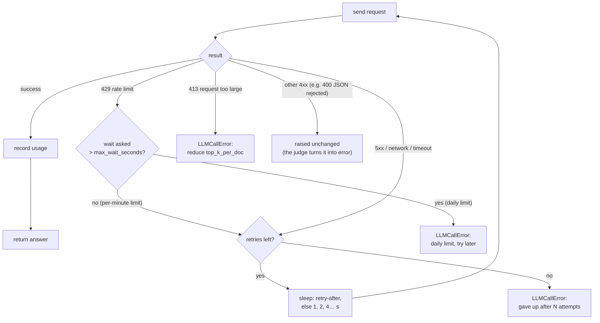

| Setting (per provider, `config.yaml`) | Default | Meaning |
|---|---|---|
| `max_retries` | 6 | new attempts after the first failure |
| `max_wait_seconds` | 60 | a longer requested wait stops the run instead of blocking it |
| `timeout_seconds` | 120 | maximum duration of one request |

| Choice | Why |
|---|---|
| **Our own loop** instead of the SDK's | visibility (retries are counted and reported), and correct handling of cases the SDK retries for nothing |
| **413 is never retried** | the request itself is too big: it will always fail |
| **A long wait stops the run** | Groq's daily limit asks for minutes; better a clear message than a silent hang |
| **Settings per provider** | limits differ between Groq, Gemini, a local server… |
| **Injectable `sleep`** | tests use a fake clock and never really wait |

**Groq free-tier limits measured on this project**

| Model | Per minute | Per day |
|---|---|---|
| `openai/gpt-oss-120b` | 8,000 tokens | 1,000 requests |
| `qwen/qwen3.8-27b` | 8,000 tokens (7,000 in, 1,000 out) | 200,000 tokens |

---

## 9. LLM calls: usage meter

The orchestrator measures each stage's usage **without knowing which stages use an LLM**.

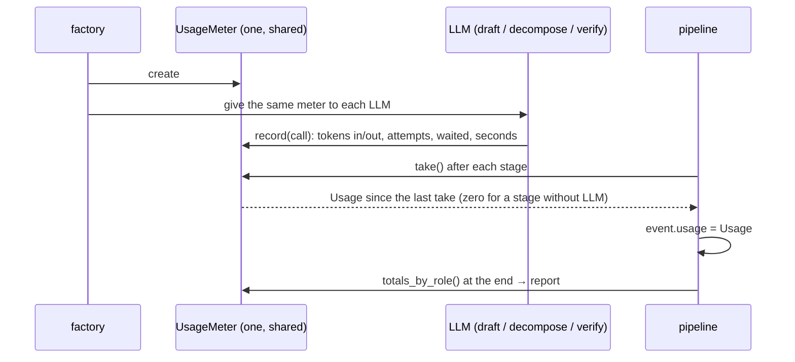

| Where | What you see |
|---|---|
| each stage event | `usage`: calls, tokens_in, tokens_out, retries, waited_seconds, seconds |
| terminal | `(2.1s, 4.5K tokens, 1 retry (waited 21s))` |
| `report.json` / `report.md` | a table per role: calls · tokens · retries · waiting · time |

> **Why a shared meter read with `take()`?** A future NLI judge makes no LLM call: it simply
> reports zero. No special case in the orchestrator.

---

## 10. Code organization

```
src/claimverify/
├── contracts.py        data objects (section 2)          ┐
├── settings.py         shape of config.yaml (section 5)  │ shared
├── factory.py          builds the stages (section 5)     │ foundation
├── events.py           event types (section 7)           │
├── reporting.py        Run, sinks, load_events           │
├── llm.py              client, retries, UsageMeter       │
├── config.py           .env loading, --db_url            ┘
├── components/         used by BOTH pipelines
│   ├── embedding.py    Embedder, BgeEmbedder
│   └── store.py        pgvector: setup, writing, search
├── indexing/           pipeline 1: files → database
│   ├── loading.py · chunking.py · ingest.py
└── answering/          pipeline 2: question → verdicts
    ├── retrieval.py · drafting.py · decomposition.py · verification.py
    ├── pipeline.py     orchestrator + report
    └── query_check.py  retrieval sanity check (no LLM)
```

| Choice | Why |
|---|---|
| **Folders by pipeline** (feature), not by technical layer | to work on chunking, you open `indexing/chunking.py` and nothing else |
| **`components/` for shared parts** | the embedder and the store serve both pipelines; the embedder must be identical in both |
| **src layout** (`src/claimverify/`) | a unique import namespace, and tests run against the *installed* package |
| **`factory` imported inside `main()`** in stage modules | `factory` imports the stage modules; importing it at the top of a stage module would be circular |

---

## 11. Tests

72 tests, **no API, no GPU, no database**: fakes replace the LLMs, the retriever, the clock.

| File | What it proves |
|---|---|
| `test_contracts.py` | labels defined once, source-consistency rules, JSON round trip |
| `test_chunking.py` | chunk sizes and overlap, chunk ids, no storage without embeddings |
| `test_interfaces.py` | every implementation satisfies its Protocol and does its job; verdicts arrive one at a time; > 12 claims work |
| `test_llm_parsing.py` | decomposition validation; each of the 9 unusable-judge cases becomes `error`; provider JSON rejection doesn't crash |
| `test_llm_retries.py` | 429 waits as asked, 5xx backs off, 413 and daily limits stop, usage accounting |
| `test_settings_factory.py` | real `config.yaml` loads, typos rejected, factory builds the right classes, judge ≠ drafter model, keys per provider, shared meter |
| `test_events.py` | event order in both pipelines, usage in events, recorded runs reload identically, console lines |

**Regression checks** for refactors (run by hand, local only): re-ingest, then compare every row,
text fingerprint and embedding with a reference saved before the change. All refactoring steps
gave identical results.

---

## 12. All design decisions

| # | Decision | Reason | Rejected alternative |
|---|---|---|---|
| 1 | Retrieve top-k **per document** | one dominant paper could hide the one that disagrees | global top-k (kept only in `query_check` for comparison) |
| 2 | The verifier **ignores the draft's citation** and re-searches the corpus | catches claims true in paper A but disputed by paper B | checking only the cited source |
| 3 | Judge from **another model family** | a model grading itself repeats its errors | the drafter's model as judge |
| 4 | **One LLM call per stage**, separate prompts | each stage can be run, debugged and evaluated alone | one prompt doing everything |
| 5 | **Pinned to English** | corpus and embedder are English; French claims degraded retrieval | multilingual prompts |
| 6 | **Real disagreement** in the corpus | tests the system on genuine conflict | injected synthetic errors |
| 7 | **Data contracts** in one module (Pydantic) | stages agree on shapes; bad data fails at the boundary | dicts and tuples |
| 8 | **Protocols + injection** | swap any stage without touching the others | hard-coded calls to implementations |
| 9 | **`config.yaml` + factory**, secrets in `.env` | reproducible, committable experiments | models and settings in `.env` or in code |
| 10 | **`contested`** and **`error`** verdicts | express source conflict; separate judge failures from conclusions | 3 verdicts with a fake `unverifiable` on failure |
| 11 | **Events + sinks**, one folder per run | every stage output is saved; the UI will replay runs | prints in each stage |
| 12 | **Own retry loop**, limits per provider | visible retries; no useless retries on 413 or daily limits | the SDK's invisible retries |
| 13 | **Shared usage meter** | cost per stage without the orchestrator knowing about LLMs | token counting inside each stage |
| 14 | **Folders by pipeline**, src layout | find code by purpose; safe imports | flat package, or layers |

---

## 13. Details worth remembering

| Detail | Where | Why it matters |
|---|---|---|
| **Fail fast at startup** | `settings.py`, `factory.py` | config, keys and models are checked before any expensive work |
| **Lazy embedder** | `BgeEmbedder.model` | creating the stages is instant; the model loads on first use |
| **One shared embedder** | `build_answering` | questions and claims must be embedded like the chunks |
| **Each provider gets only its own key** | `api_key_env` | the Groq key is never sent to Gemini |
| **LangGraph step limit raised** | `LangGraphVerifier.verify` | the default (25 steps) crashed answers with more than 12 claims |
| **Exact vector search, no index** | `setup_db` | a few ms at this size; an IVFFlat index built on an empty table dropped whole documents from per-document search |
| **Re-ingest replaces each document's rows** | `store_chunks` | no leftover chunks when the chunking changes |
| **Warning on old `.env` model variables** | `load_settings` | ignored variables must not mislead |
| **Stage outputs as JSON files** | stage CLIs `--save_to`, `--save_json` | run one stage alone; compare judges on the *same* claims |
| **Config stored in every report and run** | `report.json`, `run_started` | any result can be reproduced |
| **`experiments/smoke_k1.yaml`** | `experiments/` | the verifier takes 1 chunk per document to fit Qwen's 7,000 input tokens per minute |
| **Tests never read your `.env`** | `test_settings_factory.py` | results don't depend on the developer's machine |
| **No `Makefile` yet** | README | the README's `make` commands don't exist yet: use the `python -m` commands |

---

## 14. Known limits and next steps

**Quality issues found in the first real run** (design is fine, a stage does its job badly):

| # | Issue | Stage | Planned fix |
|---|---|---|---|
| Q1 | `SOURCES.md` is ingested and used as evidence | loader | skip non-corpus files |
| Q3 | a claim approved with the wrong support | judge / retrieval | better chunks and retrieval, then the judge prompt |
| Q4 | claims about the corpus instead of facts ("both papers say…") | decomposer | decomposer prompt |
| Q5 | chunks of ~800 tokens: the embedder only reads 512 | chunker | token-based chunking (400 tokens) |
| - | reference lists and hyphenated words in PDFs | loader | PDF cleanup |

(Q2, a citation with an old filename, is fixed.)

**Next:** the quality fixes above, one stage at a time; then evaluation (gold set, metrics,
ablations) and the UI. Details and priorities: [`roadmap.md`](roadmap.md).
